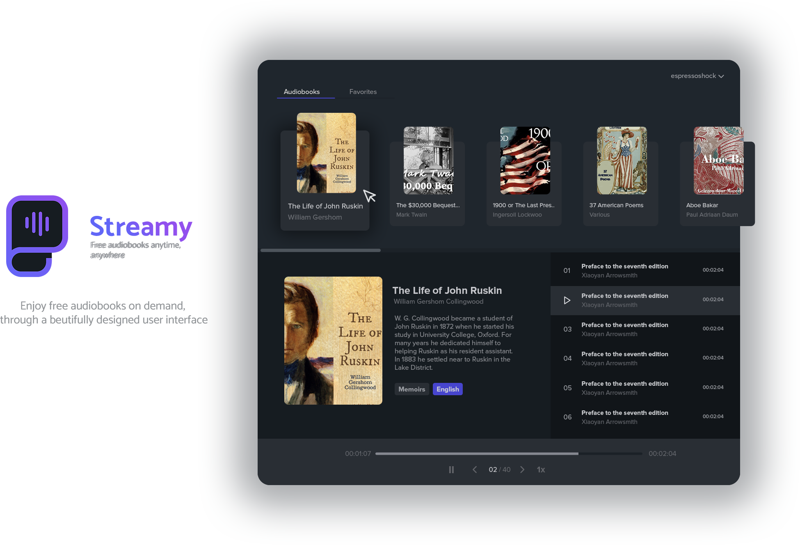
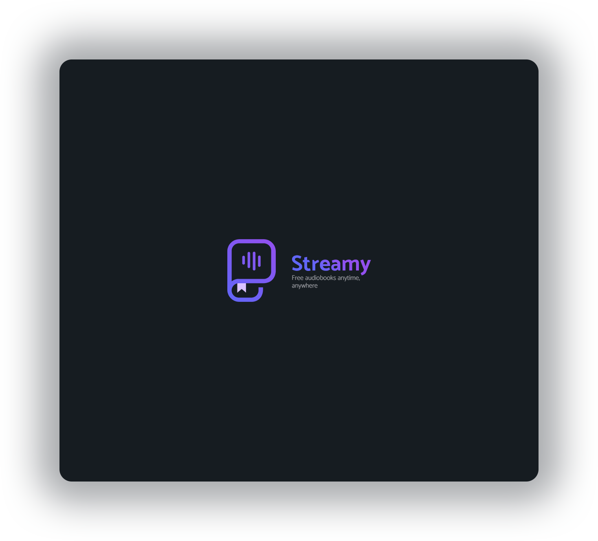
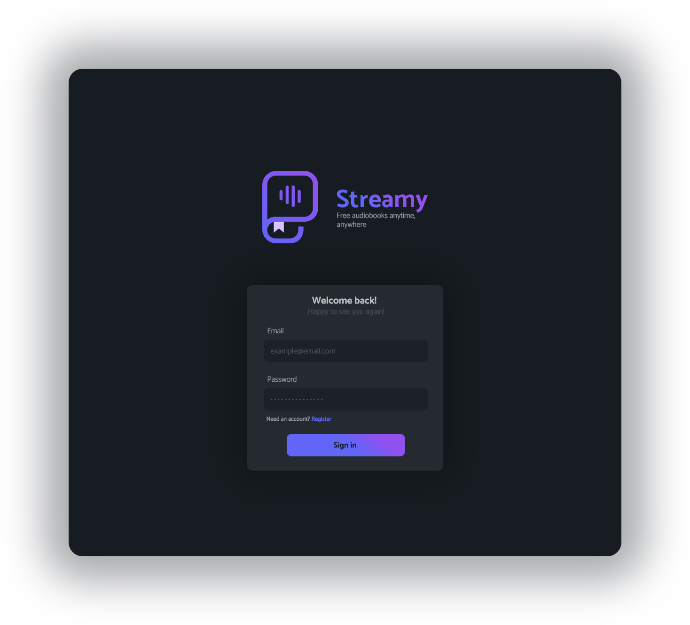
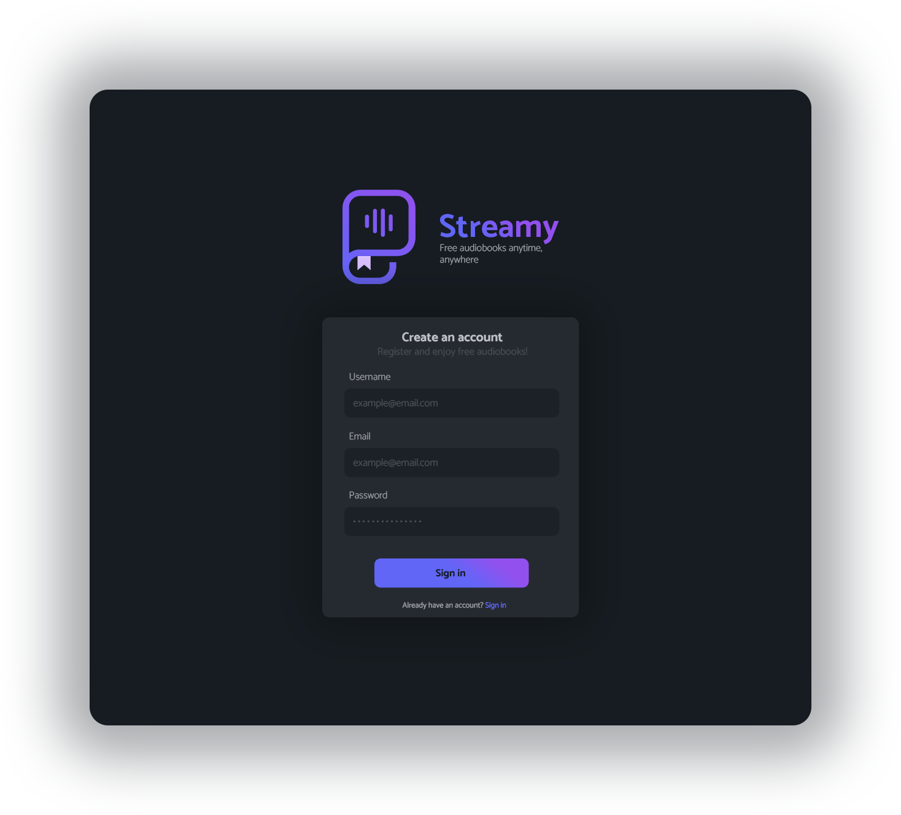
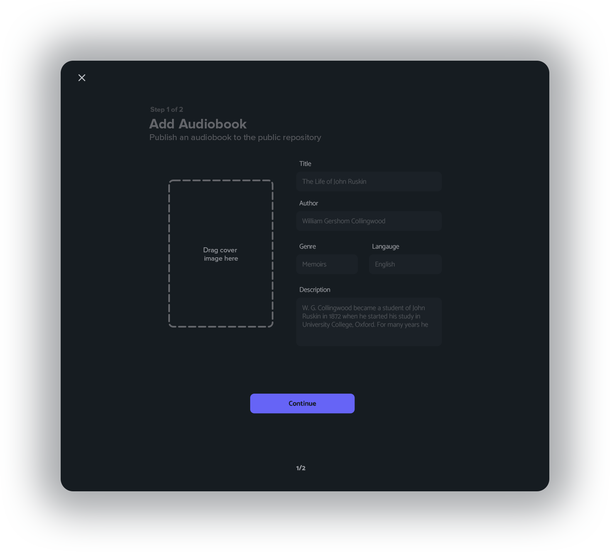
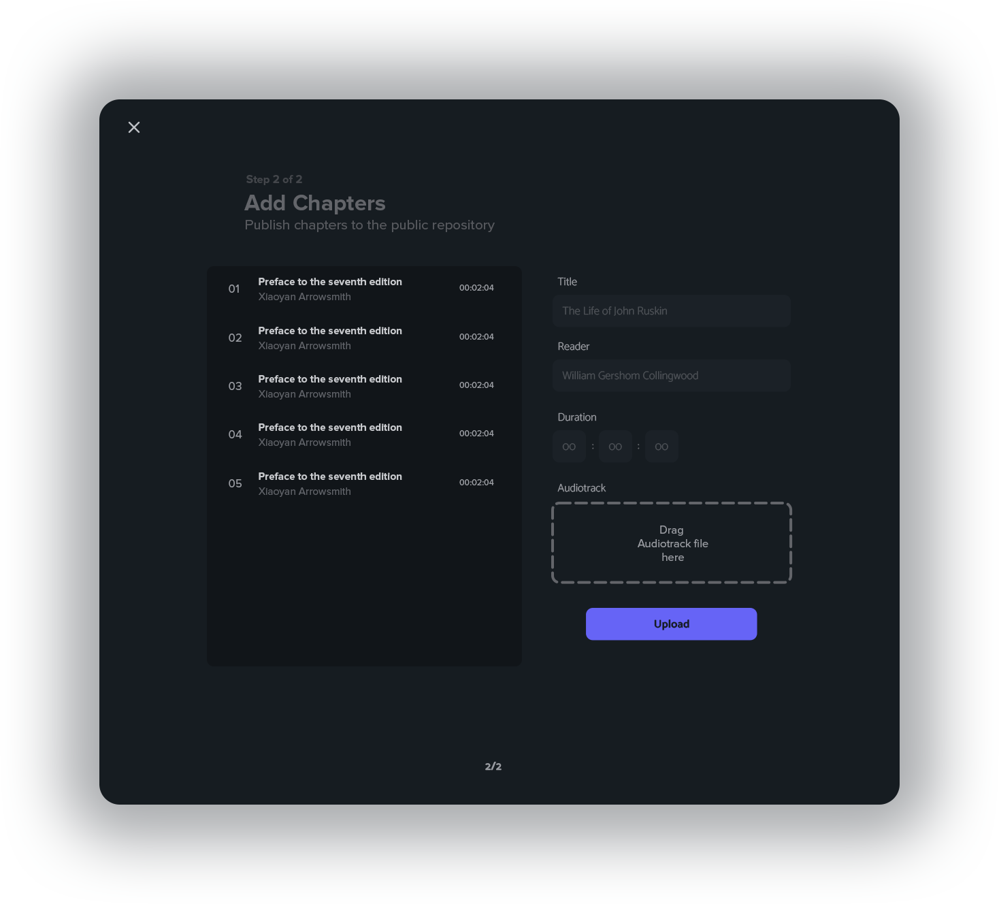

# Streamy<!-- omit in toc -->
>Modern audiobook streaming platform powered by _MongoDB_, _ElectronJS_, _NodeJS_ and _firebase serverless cloud-functions_

    

## Table of contents <!-- omit in toc -->
- [Description](#description)
- [Project structure](#project-structure)
- [Design](#design)
  - [User Interface](#user-interface)
    - [Views](#views)
      - [Splashscreen](#splashscreen)
      - [Sign in](#sign-in)
      - [Sign up](#sign-up)
      - [Player](#player)
      - [Publish audiobooks 1/2](#publish-audiobooks-12)
      - [Publish chapers 2/2](#publish-chapers-22)
    - [Logo and branding](#logo-and-branding)
  - [Framework and technologies](#framework-and-technologies)

## Description

_Streamy_ is a not just a modern _Single Page Application (SPA)_ powered by [_ReactJS_](https://reactjs.org/) and packaged and distributed with [_ElectronJS_](https://www.electronjs.org/), but is a __full-stack free audiobook streaming platform__. 

## Project structure

As a full-stack streaming platform, the project has been subdivided into the following repositories based on the product's functionality; each readme file will only dive into the specifics regarding their respective products, use the following links to learn more about the other services. 

1. Cross-platform application: [streamy-app](https://github.com/espressoshock/streamy-app)
2. Backend and cloud functions: [streamy-server](https://github.com/espressoshock/streamy-server) 
3. Web-application: (external) https://github.com/PetarPetrovic98/WebDevelopment

## Design

### User Interface

Streamy user interface has been designed from scratch with the users' needs in mind, trying to maximaxe usability and improve the user of experience.

#### Views

Here's a collection of all the most notable views within the _Streamy_ cross-platform application

##### Splashscreen 
>ElectronJS loading splash screen

    

##### Sign in 

    

##### Sign up 

    

##### Player

    

##### Publish audiobooks 1/2

    

##### Publish chapers 2/2

    

#### Logo and branding

    

### Framework and technologies

1. App packaging and distribution: 
   1. `ElectronJS`
      1. electron-forge | electron-builder | electron-packager
2. Front-end JS Framework: 
   1. `ReactJS`
      1. Router: @reach-router
3. Version control workflow: 
   1. `GithubFlow`
4. Data DB: 
   1. `MongoDB` with `GridFS`
5. Users DB:
   1. `Firebase auth` with custom `claims`
6. REST API:   
   1. `NodeJS` and `ExpressJS`
7. MServices: 
   1. `Firebase cloud functions`
