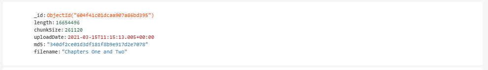

# Streamy<!-- omit in toc -->
>Modern audiobook streaming platform powered by _MongoDB_, _ElectronJS_, _NodeJS_ and _firebase serverless cloud-functions_

    

## Table of contents <!-- omit in toc -->
- [Description](#description)
- [Project structure](#project-structure)
- [Project setup and toolchain](#project-setup-and-toolchain)
  - [Package.json: scripts](#packagejson-scripts)
  - [Project structure](#project-structure-1)
  - [Naminc conventions](#naminc-conventions)
- [Routing](#routing)
- [Application Context](#application-context)
  - [Methods provided](#methods-provided)
- [Authentication](#authentication)
  - [Firebase Config](#firebase-config)
  - [User Types and Roles](#user-types-and-roles)
  - [Custom Claims](#custom-claims)
  - [ID Token](#id-token)
  - [Serverless Cloud Functions](#serverless-cloud-functions)
- [Backend](#backend)
  - [REST API](#rest-api)
  - [Database infrastructure](#database-infrastructure)
  - [Audiotracks Storing](#audiotracks-storing)
  - [Audiotrack Streaming](#audiotrack-streaming)
- [Design](#design)
  - [Framework and technologies](#framework-and-technologies)
  - [User Interface](#user-interface)
    - [Views](#views)
      - [Splashscreen](#splashscreen)
      - [Sign in](#sign-in)
      - [Sign up](#sign-up)
      - [Player](#player)
      - [Publish audiobooks 1/2](#publish-audiobooks-12)
      - [Publish chapers 2/2](#publish-chapers-22)
    - [Logo and branding](#logo-and-branding)

## Description

_Streamy_ is a not just a modern _Single Page Application (SPA)_ powered by [_ReactJS_](https://reactjs.org/) and packaged and distributed with [_ElectronJS_](https://www.electronjs.org/), but is a __full-stack free audiobook streaming platform__. 

## Project structure

As a full-stack streaming platform, the project has been subdivided into the following repositories based on the product's functionality; each readme file will only dive into the specifics regarding their respective product, use the following links to learn more about the other services. 

1. Cross-platform application: [streamy-app](https://github.com/espressoshock/streamy-app)
2. Backend and cloud functions: [streamy-server](https://github.com/espressoshock/streamy-server) 
3. Web-application: (external) https://github.com/PetarPetrovic98/WebDevelopment

## Project setup and toolchain

_Streamy_ has been built on top of [_ReactJS_](https://reactjs.org/) and packaged and distributed with [_ElectronJS_](https://www.electronjs.org/). The project has been initialized with the `npm create-react-app` to quickstart the project development, and subsequently have been added the following packages: 
1. `electron`
2. `concurrently`
3. `wait-on`
4. `cross-env`
   
Through the use of the selected package manager (yarn): `yarn add electron concurrently wait-on cross-env`

### Package.json: scripts

To facilitate development we added three scripts:

1. `electron:serve`: concurrently run ReactJS and ElectronJS, with `cross-env BROSWER=NONE` to not open ReactJS not in the browser
2. `electron:start`: we utilized the wait-on to make sure React is running before starting ElectronJS
3. `electron:build`: utilized to build our electron app

### Project structure

The React application has been divided in modules according to their functionalities, that resulted in the following tree folder structure:
1. `components`: containing all reausable components
2. `contexts`: containing all the contexts
3. `models`: containing supplementary model classes, where applicable
4. `pages`: containing all the pages
5. `services`: containing all the services

### Naminc conventions

Note that all the `folder:component` obey to the following naming conventions
> `folder-name` becomes `FolderName.js`, `FolderName.css`  
> eg. the folder `chapter-list` contains `ChapterList.js` and `ChapterList.css`

> Class components has also been preferred over functional components

## Routing

For the application routing has been utilized [@reach/router](https://reach.tech/router/), a simple React router that borrows from React Router, Ember, and Preact Router with the following paths:
   
1. __For non auth users, available paths__:
   1. `/` *(default)*: displays the `SignInPage`
   2. `/signUp`: displays the `SignUpPage`
2. __For auth users, available paths:__
   1. `/player`: display the main view, containing the audiotrack player and the audiobook library  
   2. `/add`: display the audiobook wizard, to publish new `audiobooks`, `chapters` and associated `audiotracks`

## Application Context

To effiencly and in a robust manner maintain the application's state the [React Context API](https://reactjs.org/docs/context.html) has been utilized to store:

1. `audiobooks`: containg all the audiobooks fetched from the Nodejs Database
2. `firebaseService`: instance of the firebase-service
3. `selectedAudiobook`: currently selected audiobook
4. `selecteChapter`: currently selected chapter
5. `user`: user metada contained in the transaction token including `user-role` (_privileges_)

### Methods provided

The _UserContext_, through his `UserContext.Provider`, supplies the following methods aside from its state:

1. `signIn`: handles _email/password_ authentication through the `firebase-service` and returns a promise with the `user` attached
2. `createUser`: create an _email/password_ user type account hrough the `firebase-service` and returns a promise with the `user` attached
3. `signOut`: sign the user out through the `firebase-service` as well as cleaning associated stored data such as _auth cookies_
4. `selectAudiobook`: selects an audiobook and updates application global state
5. `selectChapter`: selects a chapter and updates application global state
6. `getSelectedAudiotrackURI`: return the URI associated to the current playing audiotrack
7. `goPrevChapter`: navigate to previous chapter, where available
8. `goNextChapter`: navigate to next chapter, where available
9. `getSelChapterPos`: returns the index of selected chapter, necessary whatever the stored audiobook contains a preface, allowing for an incongruence in the start index
10. `getSelTotalChapter`: returns the `max-index` of the selected chapter
11. `refreshContext`: refreshes the context upon new data arrival
12. `updateAudiobook`: updates a specified audiobook
13. `deleteAudiobook`: deletes a specified audiobook

## Authentication

The user authentication has been implemented through the use of `firebase-auth` with the provided built-in SDKs and deployed on the _Google Cloud Platform_. 

### Firebase Config

The firebase config and credetials for the _Google Cloud Platform_ are stored in the `.env` file and attached through the `process.env`. 

### User Types and Roles

The platform design provision the following user types:

1. `user`: regular user, with `-r` (_read_) privileges
2. `admin`: platform admin, with `-rw` (_read/write_) privileges

The users can be easily managed through the `firebase-console`

### Custom Claims

The [user types and roles](#user-types-and-roles) have been implemented through the definition of `custom security rules`. A _multi-level_ access control strategies has been implemented in order to differentiate and provide administrative and customized privileges to data and resources. 

### ID Token

Every generated ID Token that is passed between client and server at every session, contains the custom claims. The tokens are trasmitted and propagated at every sign-in or re-authentication. 

### Serverless Cloud Functions

The _Serverless_ [Firebase Cloud Functions](https://firebase.google.com/docs/functions) have been investigated and utilized in order to deploy the [Custom Claims](#custom-claims). 

> The functions have been written in NodeJS and its triggered in response to _HTTP Calls_ `http.onCall`

## Backend

The backend is written in _NodeJS_ and provides as a services access to the audiobook resources stored on a _MongoDB deployment._ 

> If you wanna learn more about the _**NoSQL MongoDB deployment**_ and the server implementation, please refer to its github page:  [streamy-server](https://github.com/espressoshock/streamy-server) 

### REST API

The platform provides a _REST Open API_ through its _NodeJS_ server with the following __endpoints__:

1. `GET`  `/audiobooks`
2. `POST` `/audiobooks`
3. `PUT` `/audiobooks/:audiobookID`
4. `GET` `/audiobooks/:audiobookID`
5. `DELETE` `/audiobooks/:audiobookID`
6. `POST` `/audiobooks/:audiobookID/chapters`
7. `PUT` `/audiobooks/:audiobookID/chapters/:chapterID`
8. `GET` `/audiobooks/:audiobookID/chapters`
9. `POST` `/audiotracks`
10. `GET` `/audiotrack/:audiotrackID`

### Database infrastructure

The _Streamy_ platform utilizes two database solutions in order to operate correctly.

1. The _user data and authentication_ is stored and preocessed through the firebase infrastructure
2. The resources containing _big data_ such as books metadata as well as chapters and associated audiotracks are optimally stored in a MongoDB deployment with [GridFS](https://mongodb.github.io/node-mongodb-native/3.4/tutorials/gridfs/)

### Audiotracks Storing 

Due to the large size of the audiotracks, such documents are stored in a NoSQL MongoDB database as chuncks with the use of [GridFS](https://mongodb.github.io/node-mongodb-native/3.4/tutorials/gridfs/). Rather than storing the audiotracks in a single file, GridFS subdivides the document into multiple chunks of `255kB`, allowing more efficient storing but also _in order to facilitate the audio streaming operation_

The chunks are stored alongside the file metadata

### Audiotrack Streaming

The `GET /audiotrack/:audiotrackID` endpoint serves the audiotracks as `audio/mp3` and the tracks are streamed in `chuncks` as they are retrived from the _MongoDB GridFS_ `bucket`

## Design

### Framework and technologies

1. App packaging and distribution: 
   1. `ElectronJS`
      1. electron-forge | electron-builder | electron-packager
2. Front-end JS Framework: 
   1. `ReactJS`
      1. Router: @reach-router
3. Version control workflow: 
   1. `GithubFlow`
4. Data DB: 
   1. `MongoDB` with `GridFS`
5. Users DB:
   1. `Firebase auth` with custom `claims`
6. REST API:   
   1. `NodeJS` and `ExpressJS`
7. MServices: 
   1. `Firebase cloud functions`

### User Interface

Streamy user interface has been designed from scratch with the users' needs in mind, trying to maximaxe usability and improve the user of experience.

#### Views

Here's a collection of all the most notable views within the _Streamy_ cross-platform application

##### Splashscreen 
>ElectronJS loading splash screen

    

##### Sign in 

    

##### Sign up 

    

##### Player

    

##### Publish audiobooks 1/2

    

##### Publish chapers 2/2

    

#### Logo and branding

    

